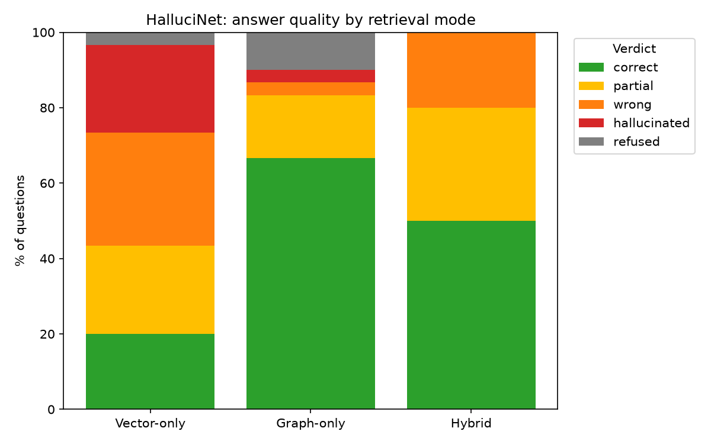

# HalluciNet — Final Report

## Hypothesis

> Combining graph-based and vector-based retrieval reduces hallucination
> on Indian historical Q&A compared to vector retrieval alone, measured on
> a curated 1857 Revolt test set.

## Scope

v1: the Revolt of 1857 (~May 1857 – 1859). 47 hand-curated entities, 50
sourced relationships, 36 fetched Wikipedia articles, 995 indexed text
chunks. Schema built generically (`period_tag`, not 1857-specific field
names) so it can extend to the wider freedom struggle later without a
redesign.

## System

1. **Vector retrieval** (Part 2): Wikipedia articles → cleaned, chunked
   (180 words, 40 overlap) → `all-MiniLM-L6-v2` embeddings → FAISS flat
   index.
2. **Knowledge graph** (Parts 1, 3): entities/relationships hand-curated
   into a spreadsheet with per-fact source citations, loaded into Neo4j
   (`:Entity` nodes typed by `:Person`/`:Location`/`:Event`/
   `:Organization`/`:Cause`; unresolved relationship objects become
   `:Concept` nodes rather than being dropped).
3. **Hybrid retrieval** (Part 4): query-time entity extraction (direct
   alias substring scan + spaCy noun-chunk/NER spans resolved via exact
   + fuzzy matching — chosen after verifying generic spaCy NER alone
   misses domain-specific entities) → 1-hop Cypher graph search + FAISS
   vector search, run independently and concatenated (graph facts first,
   then vector passages).
4. **Grounded generation** (Part 5): local Ollama (`gemma3:4b`) with a
   system prompt that forbids outside knowledge and requires an explicit
   "I don't have enough information" response when the context doesn't
   support an answer.
5. **Trust scoring** (Part 6): claim splitting (spaCy sentences) → NLI
   entailment (`cross-encoder/nli-MiniLM2-L6-H768`, an independent model —
   not the generating LLM grading itself) against the retrieved evidence,
   sentence-decomposed for accurate scoring. Trust score = % of claims
   entailed.
6. **Evaluation** (Part 7): 30-question hand-authored test set, ablated
   across vector-only / graph-only / hybrid retrieval, classified
   correct/partial/wrong/hallucinated/refused via an automated proxy
   (entity match + trust score).
7. **App** (Part 8): FastAPI backend (`POST /ask`), Streamlit frontend
   with a pre-cached demo-question fallback.

## Results

| mode | correct | partial | wrong | hallucinated | refused |
|---|---|---|---|---|---|
| graph-only | 20/30 | 5 | 1 | 1 | 3 |
| hybrid | 15/30 | 9 | 6 | 0 | 0 |
| vector-only | 6/30 | 7 | 9 | 7 | 1 |

**This table needs its caveats to be read honestly** (full detail in
[docs/part7_notes.md](part7_notes.md)):

- The test set was authored directly from the same KG that graph-only
  retrieves from, which structurally advantages graph-only — this is
  closer to "does graph search find graph facts" than a neutral benchmark.
- The automated entity-match scorer favors answers that echo canonical KG
  entity names, which graph-derived answers naturally do and vector-only
  prose often doesn't even when factually correct (two concrete examples
  in `part7_notes.md`: T25's "maladministration" vs the test set's
  "misgovernance"; T21's accurate but non-canonical phrasing).
- Net effect: vector-only's apparent error rate is inflated by scoring
  brittleness, not just by real invented facts. The true gap between
  hybrid and graph-only is likely narrower than the raw numbers suggest.

**What the numbers do support, with case-study evidence, independent of
those caveats:**

- **Hybrid had zero hallucinations** in this run (vs 7 for vector-only, 1
  for graph-only) — its failures were mostly "wrong but grounded," a
  safer failure mode than inventing facts outright.
- **Graph-only's 1-hop limit is real and reproducible** (T13: correctly
  refused a 2-hop question graph search couldn't reach; hybrid, given the
  same graph gap plus vector context, confidently answered with an
  unrelated-but-real fact instead of refusing).
- **Vector retrieval adds real coverage the graph doesn't have** (T30: a
  fact that exists only in the fetched prose, not as a KG relationship —
  graph-only correctly said it didn't know; vector-only and hybrid both
  found it).
- **A specific KG design gap caused one genuine graph hallucination**
  (T10: a `:Concept` node not linked back to the `:Location` entity named
  in its own text — root-caused and documented, not hand-waved).

## What went right in the process

Building and testing against real output caught real bugs, not just
theoretical ones:

- Part 6: the refusal phrase itself was being scored as an unsupported
  claim (0% trust for the *correct* behavior); evidence chunks fed to the
  NLI model whole instead of sentence-split cut real claims' scores by an
  order of magnitude. Fixing both took the 10-question average trust
  score from 21% to 61% — the 21% number was mostly a bug in our own
  evaluation code, not a true hallucination rate.
- Part 7: found and fixed a synonym mismatch in the test set itself
  (T25), and a missing entity alias ("Tatya Tope") that would have caused
  real query-time entity extraction failures, not just an eval scoring
  quirk.

## Recommendations before presenting these numbers as final

1. Run the master plan's suggested 2-rater manual agreement check on a
   sample of the 90 ablation answers — the automated scorer's known
   brittleness to paraphrasing means it should not be the last word.
2. Fix the T10 Concept-node linkage gap if time permits.
3. Consider authoring a second, independently-sourced batch of test
   questions (not derived from the same KG) for a fairer vector-vs-graph
   comparison in any future iteration.

## Repository

[github.com/yohannshroff/Hallucinet](https://github.com/yohannshroff/Hallucinet)
— see `README.md` for setup and the full pipeline, and `docs/part*_notes.md`
for what was built, run, and found in each part.
